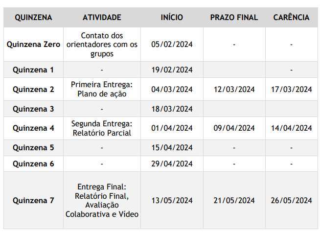
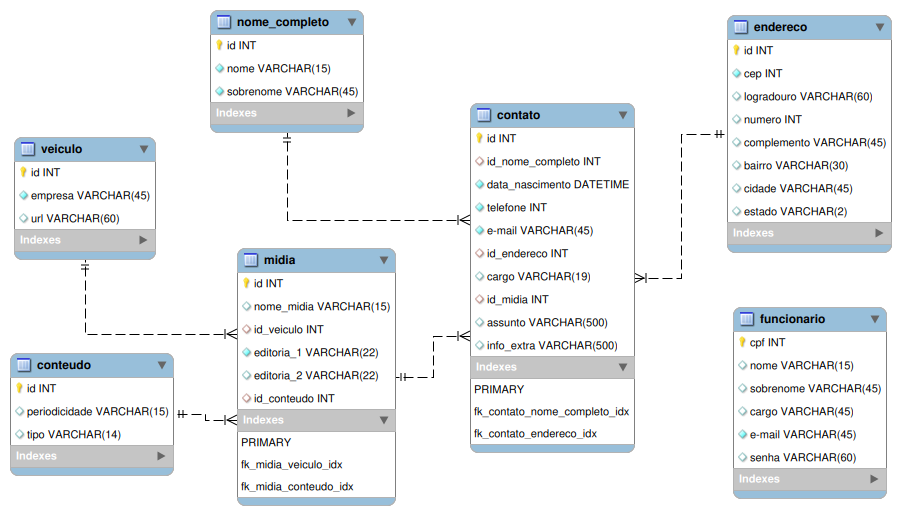

# Projeto Integrador em Computação I
**DRP03 – PJI110 -Sala 002- Grupo 003**

## Prazos de entregas



## Modelo Relacional do Banco de Dados




## Desenvolvimento local

Suba os containers:

```sh
$ docker compose up -d
```

Instale as dependencias:

```sh
$ docker compose exec composer install
```

Rode as migrations (cria as tabelas necessárias):

```sh
$ docker compose exec app php artisan migrate
```

Abra o browser e acesse o endereço abaixo:

```
http://localhost:8000
```

Ao final, caso deseje, derrube os containers:

```sh
$ docker compose down
```

## Tecnologias utilizadas:

* Docker
* MySQL
* MySQL workbench
* Laravel