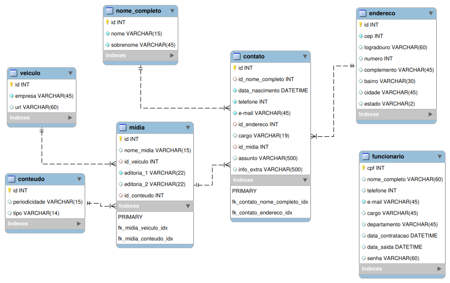

# Projeto Integrador em Computação I
**DRP03 – PJI110 -Sala 002- Grupo 003**

## Prazos de entregas


## Modelo Relacional do Banco de Dados




## Desenvolvimento local

Para subir o banco de dados MySQL localmente execute o seguinte comando:

```sh
$ docker compose up -d
```

Para encerrar o container execute o seguinte comando:

```sh
$ docker compose down
```

Concecte usando MySQL Workbench com as seguintes configurações:

* Connection Name: Docker MySQL (or any name you prefer) 
* Hostname: 127.0.0.1 (or the Docker host's IP if you're not running it locally)
* Port: 3306
* Username: root 
* Password: rootpassword 
* Default Schema: projeto_integrador_db

## Tecnologias utilizadas:

* Docker
* MySQL
* MySQL workbench
* todo: inserir as tecnologias que serão usadas no projeto